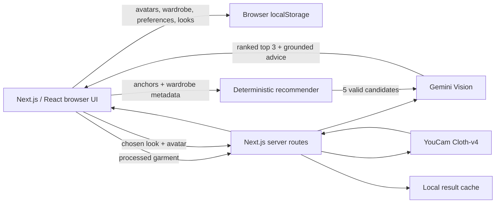

# TheLook

**An AI stylist that builds complete outfits from a real wardrobe, explains why they work, and proves the selected look with YouCam virtual try-on.**

TheLook is a web-first submission for the **YouCam API Skin AI & eCommerce VTO Hackathon**. A shopper can upload garments, receive three grounded outfit recommendations, choose one, and render it on a saved full-body photo.

## What makes it different

Most virtual try-on demos begin with a fixed product and render immediately. TheLook separates the free styling decision from the credit-consuming proof step:

```text
Personal wardrobe
  → deterministic outfit construction
  → Gemini visual reranking and explanation
  → choose one of three real-SKU looks
  → explicit “Show On Me”
  → YouCam Cloth-v4 render
```

- **The algorithm constructs valid outfits.** It enforces garment slots, layering, color, fit, formality, season, occasion, styling goals, and diversity.
- **Gemini acts as a visual stylist.** It reranks only valid candidates and cannot invent products.
- **YouCam supplies the proof.** Credits are spent only after the user explicitly asks to see the chosen look.

## Features

- Curated catalog displayed as boutique garment rails and shelves
- Multiple selected anchors and valid base/mid/outer layering
- Device upload or direct image URL for personal garments
- Client-side background removal; original garment upload is not persisted
- Gemini Vision metadata: category, layer, color, palette, fit, formality, season, style, and material
- Deterministic five-candidate outfit generator with top-three diversity
- Gemini visual reranking with deterministic fallback
- Optional occasion and styling-goal preferences
- Multiple saved 9:16 avatar photos
- YouCam Cloth-v4 full-look rendering with image normalization and result caching
- Saved lookbook, outfit details, mock bag, and checkout flow
- Premium loading sequence, responsive interface, final TheLook branding, and optional sound design
- Mock mode for development without spending YouCam units

## Architecture



### Wardrobe ingestion

```text
Device file or direct URL
  → guarded server fetch when needed
  → browser image normalization
  → browser background removal
  → Gemini Vision metadata extraction
  → transparent cutout + metadata saved to this browser
```

### Recommendation

Fixed catalog pairs use an offline OpenCLIP/Polyvore compatibility matrix. Pairs containing uploaded garments use structured metadata compatibility. Outfit formulas and hard constraints create five valid candidates; Gemini sees their real images and returns the strongest three with explanations.

### Try-on

The server normalizes all images to JPEG, uploads them through Perfect Corp's File API, creates Cloth-v4 tasks, polls for completion, downloads the result, and caches identical avatar/outfit combinations. Layered upper garments are composed into one reference image; bottoms are rendered as a subsequent step.

## Technology

- Next.js 16 App Router
- React 19 and TypeScript
- Tailwind CSS 4
- Sharp for server-side image normalization and composition
- `@imgly/background-removal` for browser-side cutouts
- Gemini Vision (`gemini-2.5-flash` by default)
- Perfect Corp YouCam Cloth-v4
- OpenCLIP embeddings and a Polyvore-trained compatibility model in the offline catalog pipeline

## Local setup

### Requirements

- Node.js 22+
- npm
- A Perfect Corp / YouCam API key for real rendering
- Optional Gemini API key for visual categorization and reranking

### Install and run

```bash
git clone https://github.com/aposalik/TheLook.git
cd TheLook/web
npm ci
cp .env.local.example .env.local
npm run dev
```

Open <http://localhost:3000>.

Edit `web/.env.local` through your local editor. Never commit it or share credentials in issues, pull requests, screenshots, commands, or chat.

```dotenv
PERFECTCORP_KEY=replace_with_your_youcam_key
GEMINI_API_KEY=replace_with_your_gemini_key
GEMINI_MODEL=gemini-2.5-flash
```

Only `PERFECTCORP_KEY` is required for a real Cloth-v4 render. The V2 API uses the key directly as a Bearer token; `PERFECTCORP_SECRET` is not used by this application.

### Credit-free development

Set this in `web/.env.local`:

```dotenv
MOCK=1
```

Mock mode exercises the UI and recommendation flow without starting a YouCam task. Turn it off only for deliberate end-to-end verification.

## Verification

From `web/`:

```bash
npm run lint
npx tsc --noEmit
npm run build
```

Pull requests run the same checks through GitHub Actions.

## Privacy and security

Current hackathon behavior:

- API credentials remain server-side.
- Avatars, uploaded wardrobe items, preferences, and saved looks stay in the user's browser storage.
- Garment originals are discarded after processing; only the processed cutout is saved.
- Avatar and garment bytes are sent to the server only when required for analysis or try-on.
- Real try-on images are sent to Perfect Corp for Cloth-v4 processing.
- Direct image URLs pass protocol, DNS/private-address, redirect, MIME, timeout, and size checks.
- Generated local results and `.env.local` files are excluded from Git.

There is currently **no account system or cloud synchronization**. Before a public production launch, TheLook needs private object storage, per-visitor ownership, durable render caching, and server-side rate limits to protect the YouCam credit pool.

## Current limitations

- Browser-local wardrobes do not synchronize across devices.
- Browser storage has limited capacity for many image uploads.
- The local filesystem result cache is suitable for the demo but not durable serverless hosting.
- Catalog variety is intentionally small and curated.
- Accessories are recommended but not rendered by the current pipeline.
- Checkout is intentionally mocked.

## Repository map

```text
web/app/components/             Fitting room UI
web/app/api/recommend/          Deterministic candidate API
web/app/api/stylist/rerank/     Gemini visual reranker
web/app/api/wardrobe/           Upload analysis and guarded URL fetch
web/app/api/tryon-look/         Full-look Cloth-v4 orchestration
web/lib/recommend.ts            Outfit construction and scoring
web/lib/gemini.ts               Server-side Gemini JSON client
web/lib/youcam.ts               Server-side Perfect Corp client
web/data/                       Runtime catalog and compatibility matrix
_experiments/catalog_pipeline.py Offline catalog/cutout/embedding pipeline
scripts/generate_sound_pack.py   Reproducible original UI sound pack
```

## Collaboration

`main` is protected. Use:

```text
issue → feature branch → pull request → approval → squash and merge
```

See [CONTRIBUTING.md](CONTRIBUTING.md).

## Hackathon

- Event: YouCam API Skin AI & eCommerce VTO Hackathon
- Edition: eCommerce VTO, Devpost ID 31400
- Deadline: November 2, 2026
- API used: Perfect Corp YouCam AI Clothes Virtual Try-On (Cloth-v4)

Submission screenshots, the demo video, and the final Devpost write-up are intentionally produced after the product UI and hosted flow are frozen.
